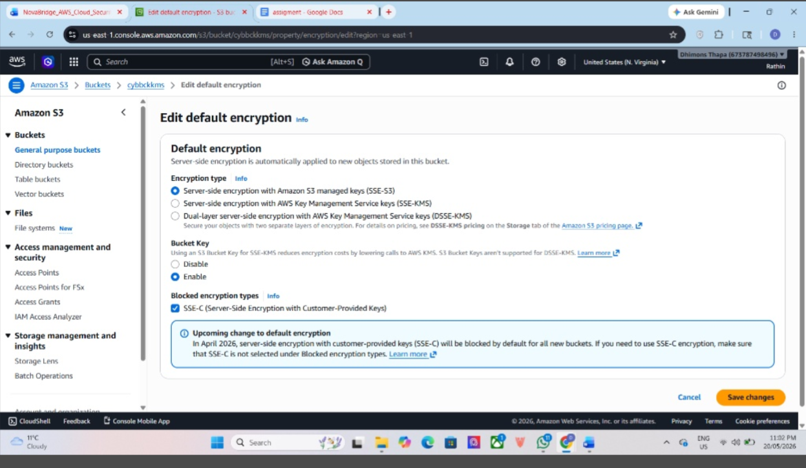
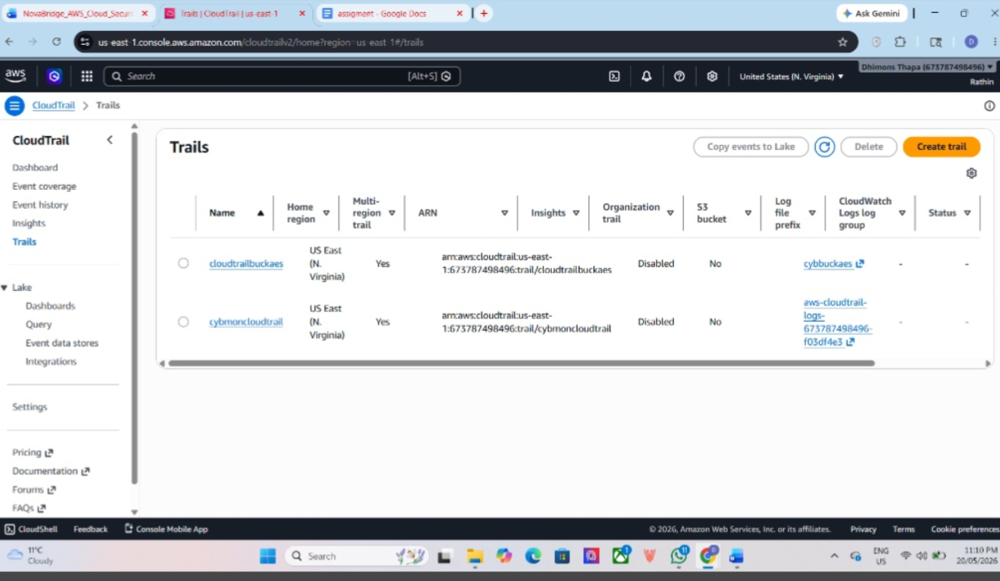
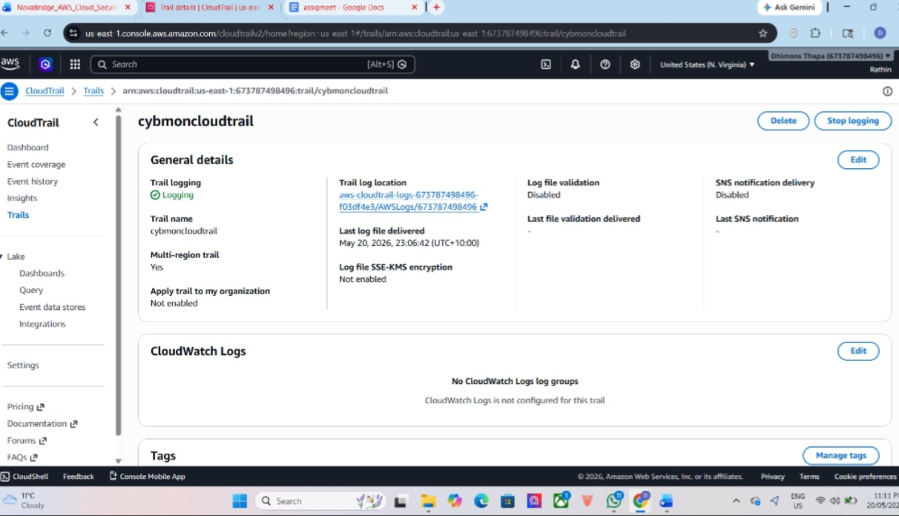

# AWS Cloud Security Infrastructure & Audit Governance

## Project Overview
This project establishes a hardened, enterprise-ready cloud infrastructure baseline focused on strict data confidentiality, continuous security auditing, and robust identity governance within Amazon Web Services (AWS). 

## Core Architecture & Security Controls Implemented

### 1. Hardened Storage & Data Protection
* **Amazon S3 Configuration:** Provisioned a centralized storage repository with global **Block Public Access** controls enabled to prevent unauthorized external exposure.
* **Encryption-at-Rest:** Enforced mandatory **Server-Side Encryption (SSE-S3)** using managed Amazon S3 keys to securely protect data assets.

* #### Implementation Evidence:
* 
  

### 2. Continuous Monitoring & Threat Auditing
* **AWS CloudTrail Deployment:** Architected a comprehensive organizational tracking trail monitoring all multi-region global management events.
* **Log Destination Security:** Configured the continuous event stream to pipe raw Read/Write API audit logs directly into a hardened, isolated S3 bucket for permanent logging.

* #### Implementation Evidence:

### 3. Identity Governance & Access Management (IAM)
* **Least Privilege Enforcement:** Standardized access provisioning by binding structural policies to user environments, explicitly narrowing authorization parameters.
* **Operational Scope:** Implemented granular permissions boundaries (e.g., ReadOnlyAccess frameworks) to safeguard critical infrastructure segments against unauthorized modifications.
